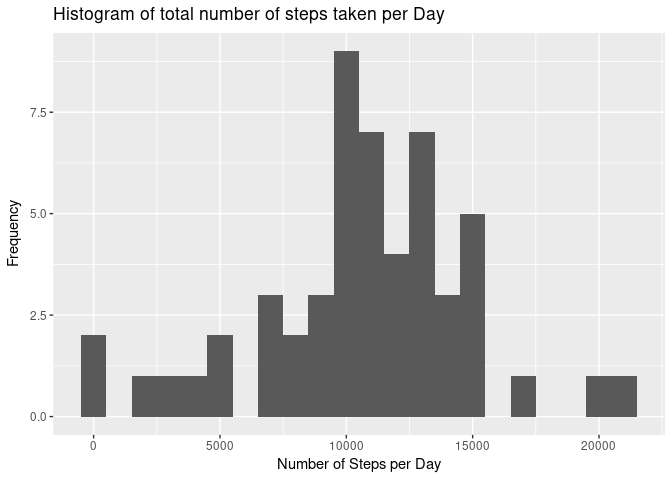
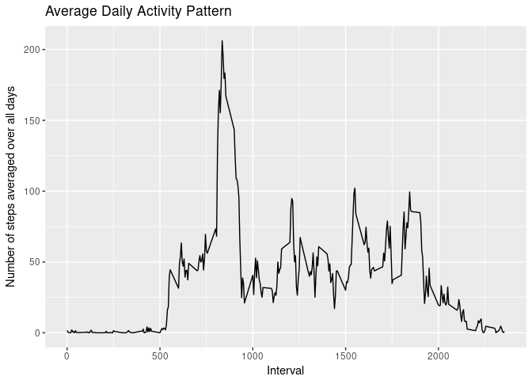
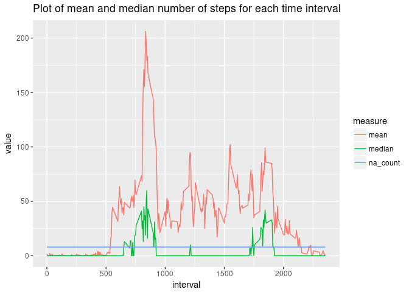
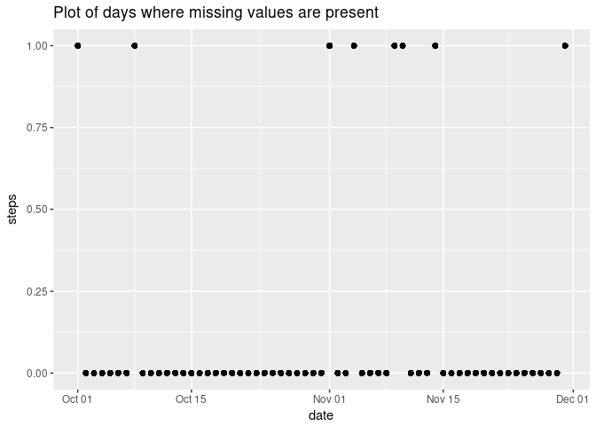
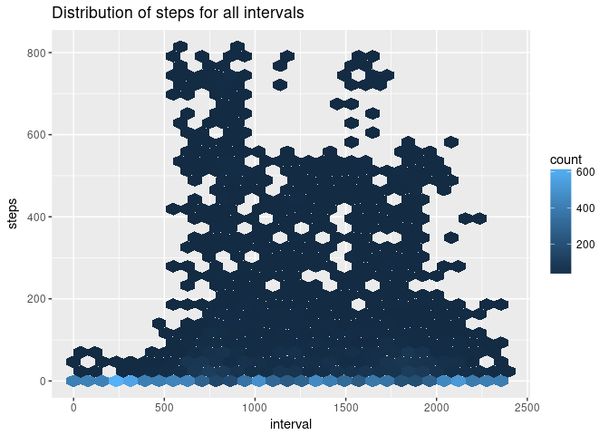
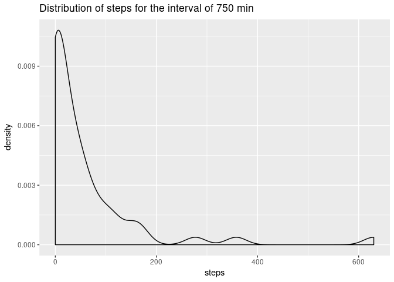
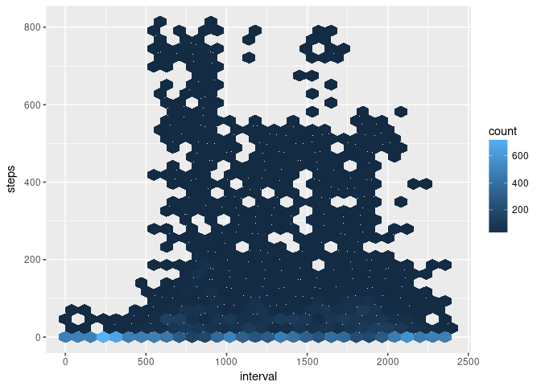
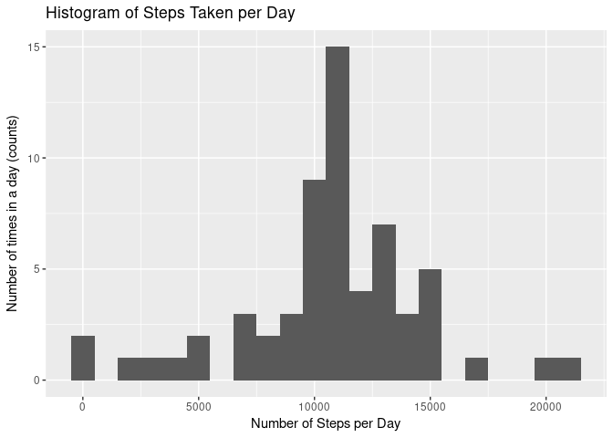
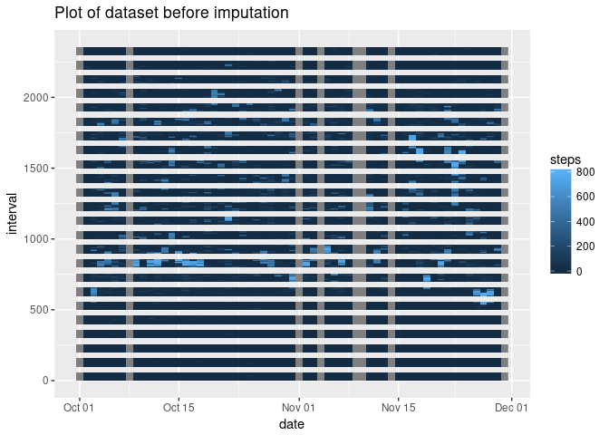
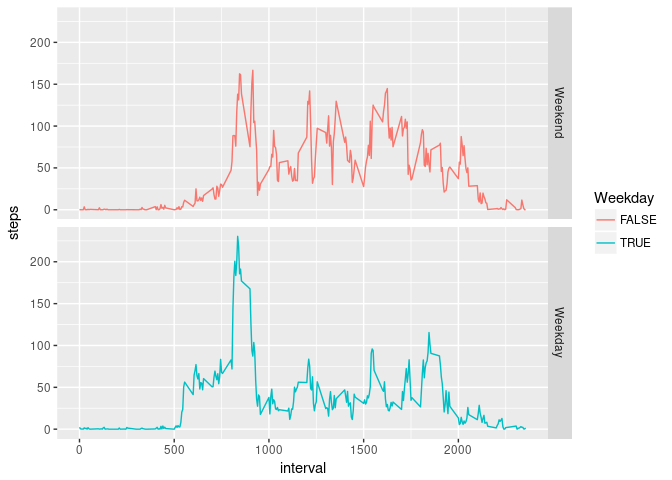

## Introduction

It is now possible to collect a large amount of data about personal movement using activity monitoring devices such as a Fitbit, Nike Fuelband, or Jawbone Up. These type of devices are part of the “quantified self” movement – a group of enthusiasts who take measurements about themselves regularly to improve their health, to find patterns in their behavior, or because they are tech geeks. But these data remain under-utilized both because the raw data are hard to obtain and there is a lack of statistical methods and software for processing and interpreting the data.

This assignment makes use of data from a personal activity monitoring device. This device collects data at 5 minute intervals through out the day. The data consists of two months of data from an anonymous individual collected during the months of October and November, 2012 and includes the number of steps taken in 5 minute intervals each day.

The variables included in this dataset are:

* steps: Number of steps taking in a 5-minute interval (missing values are coded as NA)
* date: The date on which the measurement was taken in YYYY-MM-DD format
* interval: Identifier for the 5-minute interval in which measurement was taken

The dataset is stored in a comma-separated-value (CSV) file and there are a total of 17,568 observations in this dataset.

In this report, we carry out some exploratory analysis on the data in order to observe trends in the walking behaviour of users throughout the week.

Before we begin, we load the relevant packages via pacman:


```r
if (!require("pacman")) install.packages("pacman")
```

```
## Loading required package: pacman
```

```r
pacman::p_load(knitr, dplyr, ggplot2, tidyr, hexbin, timeDate)
```

## Loading and preprocessing the data

First, we read in the CSV file and do some preliminary examinations of the data:


```r
df <- read.csv('activity.csv')
head(df)
```

```
##   steps       date interval
## 1    NA 2012-10-01        0
## 2    NA 2012-10-01        5
## 3    NA 2012-10-01       10
## 4    NA 2012-10-01       15
## 5    NA 2012-10-01       20
## 6    NA 2012-10-01       25
```

```r
df$date <- as.Date(df$date)
str(df)
```

```
## 'data.frame':	17568 obs. of  3 variables:
##  $ steps   : int  NA NA NA NA NA NA NA NA NA NA ...
##  $ date    : Date, format: "2012-10-01" "2012-10-01" ...
##  $ interval: int  0 5 10 15 20 25 30 35 40 45 ...
```

We note that there are many missing values present in a string from the first few rows of the dataset. 


## What is mean total number of steps taken per day?

Here we ignore the missing values first. In order to calculate the mean total number of steps taken per day we have to aggregate the data by date, which will be done via functions in the `dplyr` package. 


```r
df_groupedbyday <- df %>% group_by(date) %>% summarise(steps_perday = sum(steps))
head(df_groupedbyday)
```

```
## # A tibble: 6 x 2
##   date       steps_perday
##   <date>            <int>
## 1 2012-10-01           NA
## 2 2012-10-02          126
## 3 2012-10-03        11352
## 4 2012-10-04        12116
## 5 2012-10-05        13294
## 6 2012-10-06        15420
```

```r
ggplot(df_groupedbyday, aes(x = steps_perday)) + geom_histogram(binwidth = 1000) + 
  labs(title = "Histogram of total number of steps taken per Day", x = "Number of Steps per Day", 
       y = "Frequency")
```

```
## Warning: Removed 8 rows containing non-finite values (stat_bin).
```

<!-- -->

The distribution of the total number of steps taken in a day appears to have a central peak and relatively heavy tails.


```r
mean(df_groupedbyday$steps_perday, na.rm = TRUE)
```

```
## [1] 10766.19
```

```r
median(df_groupedbyday$steps_perday, na.rm = TRUE)
```

```
## [1] 10765
```

The mean and median are also nearly identical. 

## What is the average daily activity pattern?

In order to study the average daily activity pattern, we make a time series plot of the 5-minute interval (x-axis) and the average number of steps taken, averaged across all days (y-axis).


```r
df_avgbyint <- df %>% group_by(interval) %>% 
  summarise(mean_steps_perint = mean(steps, na.rm = TRUE))

p <- ggplot(df_avgbyint, aes(x = interval, y = mean_steps_perint)) +
  geom_line() + labs(title = "Average Daily Activity Pattern", x = "Interval", 
                     y = "Number of steps averaged over all days")

print(p)
```

<!-- -->

Next, we obtain the 5-minute interval that contains the maximum number of steps averaged across all days in the dataset:


```r
df_avgbyint[which.max(df_avgbyint$mean_steps_perint),]
```

```
## # A tibble: 1 x 2
##   interval mean_steps_perint
##      <int>             <dbl>
## 1      835               206
```

The interval at **835** minutes contains the maximum number of steps at **206** steps.

## Imputing missing values

As mentioned before, there are a number of values in the `steps` variable that are missing (coded as NA). The presence of missing data may introduce bias into some calculations or summaries of the data. 

First we check the total number of missing values in the dataset.


```r
sum(is.na(df$steps))
```

```
## [1] 2304
```

There are **2304** missing values in the dataset, under the `steps` variable.

Next, we would like to devise a strategy to impute the missing values in the dataset. We will proceed by comparing the mean and medians of each 5-minute interval over all the days in the dataset. This is guided by the idea that people may follow a rough daily schedule, with peaks and valleys over certain time intervals. So instead of averaging (or taking the median) over each day, we take the average or median over each interval instead. We also consider the distribution of missing values over the 5-minute time intervals.


```r
count_na <- function(x) {sum(is.na(x))}

df_nacount <- df %>% group_by(interval) %>%
  summarise(na_count=count_na(steps))

head(df_nacount)
```

```
## # A tibble: 6 x 2
##   interval na_count
##      <int>    <int>
## 1        0        8
## 2        5        8
## 3       10        8
## 4       15        8
## 5       20        8
## 6       25        8
```

```r
df_meanmedian <- df %>% group_by(interval) %>% 
  summarise_at(vars(steps), funs(mean, median), na.rm = TRUE)

head(df_meanmedian)
```

```
## # A tibble: 6 x 3
##   interval   mean median
##      <int>  <dbl>  <int>
## 1        0 1.72        0
## 2        5 0.340       0
## 3       10 0.132       0
## 4       15 0.151       0
## 5       20 0.0755      0
## 6       25 2.09        0
```

```r
df_measures <- left_join(df_meanmedian, df_nacount, by = "interval") %>%
  gather(key = measure, value = value, -interval)

q <- ggplot(df_measures, aes(x = interval, y = value, colour = measure)) +
  geom_line() + labs(title = "Plot of mean and median number of steps for each time interval")

print(q)
```

<!-- -->

There are several points to note from this plot:

1. The mean number of steps are always larger (sometimes much larger) than the median number of steps, indicating the frequent presence of outliers, or a long right tail in the distribution.

2. Many of the median values are at zero, indicating that the distribution of the number of steps are clustered at zero during the intervals in the early morning (0 to ~600), midday (~1000 to ~1700) and late night (> ~1900), the times where one would be sleeping or working.

3. The number of missing values is completely constant across all intervals. This could indicate that entire days are missing from the dataset.


```r
length(unique(df$date))
```

```
## [1] 61
```

```r
length(unique(df$interval))
```

```
## [1] 288
```

```r
df_nalist <- cbind(df)
df_nalist$steps <- as.numeric(is.na(df_nalist$steps))

ggplot(df_nalist, aes(x = date, y = steps)) + geom_point() + 
  labs(title = "Plot of days where missing values are present")
```

<!-- -->

From the above plot one can see that there were 8 days in which missing values were present. Given this info and the fact that there are 288 unique intervals and 2304 missing values in total, it appears that these 8 days are effectively completely absent in the dataset (288 x 8 = 2304). Therefore the missing values are not entirely missing completely at random.

We can also plot the distribution of the data as a 2D plot:


```r
df_dist <- df %>% group_by(interval)

ggplot(df_dist, aes(x = interval, y = steps)) + 
  geom_hex() + labs(title="Distribution of steps for all intervals")
```

```
## Warning: Removed 2304 rows containing non-finite values (stat_binhex).
```

<!-- -->

```r
ggplot(filter(df_dist, interval == 750), aes(x=steps)) +
  geom_density() + labs(title="Distribution of steps for the interval of 750 min")
```

```
## Warning: Removed 8 rows containing non-finite values (stat_density).
```

<!-- -->

We see here how the number of steps across all intervals are clustered around zero. By imputing missing values with the median of each interval, we are likely to underestimate the number of steps taken for those missing days. Therefore we will choose to use the mean instead for imputation, as it will likely preserve the structure of the data better:


```r
n <- nrow(df)

df_imputed <- cbind(df)

for (i in 1:n) {
  if (is.na(df_imputed$steps[i])) {
    interval_i <- df_imputed$interval[i]
    mean_step <- filter(df_meanmedian, interval == interval_i)$mean
    df_imputed$steps[i] <- mean_step
  }
}

head(df_imputed)
```

```
##       steps       date interval
## 1 1.7169811 2012-10-01        0
## 2 0.3396226 2012-10-01        5
## 3 0.1320755 2012-10-01       10
## 4 0.1509434 2012-10-01       15
## 5 0.0754717 2012-10-01       20
## 6 2.0943396 2012-10-01       25
```

```r
dfn_dist <- df_imputed %>% group_by(interval)

ggplot(dfn_dist, aes(x = interval, y = steps)) + 
  geom_hex()
```

<!-- -->

The distribution over intervals appears relatively unchanged with the inclusion of the imputed values.


```r
dfn_groupedbyday <- df_imputed %>% group_by(date) %>% summarise(steps_perday = sum(steps))
head(df_groupedbyday)
```

```
## # A tibble: 6 x 2
##   date       steps_perday
##   <date>            <int>
## 1 2012-10-01           NA
## 2 2012-10-02          126
## 3 2012-10-03        11352
## 4 2012-10-04        12116
## 5 2012-10-05        13294
## 6 2012-10-06        15420
```

```r
ggplot(dfn_groupedbyday, aes(x = steps_perday)) + geom_histogram(binwidth = 1000) + 
  labs(title = "Histogram of Steps Taken per Day", x = "Number of Steps per Day", 
       y = "Number of times in a day (counts)")
```

<!-- -->

With the imputed values, the distribution of total number of steps taken per day has changed, with a much increased peak. This  is expected since we used the mean of each interval for imputation.


```r
mean(dfn_groupedbyday$steps_perday, na.rm = TRUE)
```

```
## [1] 10766.19
```

```r
median(dfn_groupedbyday$steps_perday, na.rm = TRUE)
```

```
## [1] 10766.19
```

The mean remains unchanged while the median is identical now, both at **10766.19**. These values are nearly the same as the values before imputation.

We can also make plots of the entire dataset before and after imputation:

```r
ggplot(df, aes(x = date, y = interval)) + geom_raster(aes(fill=steps)) +
  labs(title="Plot of dataset before imputation")
```

<!-- -->

```r
ggplot(df_imputed, aes(x = date, y = interval)) + geom_raster(aes(fill=steps)) +
  labs(title="Plot of dataset after imputation")
```

<!-- -->

## Are there differences in activity patterns between weekdays and weekends?

In this section, we will compare the difference in activity patterns between weekdays and weekends. To achieve this we will add an additional column that labels whether a day is a weekend or not.


```r
dfn_split <- mutate(df_imputed, Weekday = isWeekday(date, wday = 1:5))

dfns_avgbyint <- dfn_split %>% group_by(interval, Weekday) %>% 
  summarise_at(vars(steps), funs(mean))

head(dfns_avgbyint)
```

```
## # A tibble: 6 x 3
## # Groups:   interval [3]
##   interval Weekday  steps
##      <int> <lgl>    <dbl>
## 1        0 F       0.215 
## 2        0 T       2.25  
## 3        5 F       0.0425
## 4        5 T       0.445 
## 5       10 F       0.0165
## 6       10 T       0.173
```

Next we can plot the average activity separately for weekdays and weekends:


```r
labels <- c('FALSE'="Weekend", 'TRUE'="Weekday")

ggplot(dfns_avgbyint, aes(x = interval, y = steps)) +
  geom_line(aes(colour = Weekday)) + facet_grid(Weekday~., labeller = as_labeller(labels))
```

<!-- -->

It can be seen clearly how the activity for weekdays differs from the activity for weekends. The activity for weekdays peaks around the morning and evening (intervals ~750 and ~1800) whereas for weekends the activity is spread out more evenly. This likely corresponds to people having to travel to work during the weekdays at fixed timings while being more free to walk throughout the day during weekends. Also, activity starts to pick up earlier during weekdays compared with weekends.
